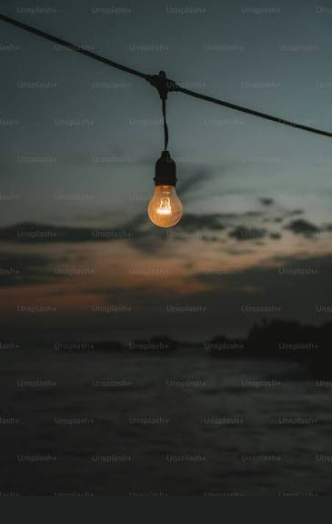
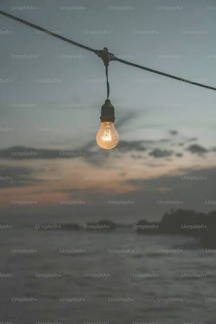
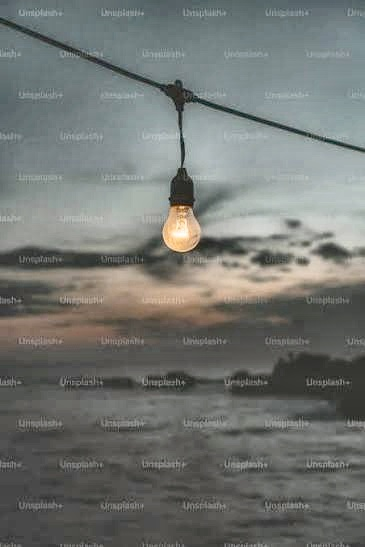
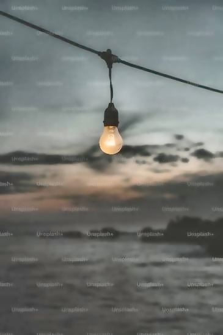

# 🌙 Low-Light Image Enhancement

A Python-based image processing project designed to enhance images captured under low-light conditions using a multi-stage image enhancement pipeline.

The project combines **Gamma Correction, CLAHE, Bilateral Filtering, and Color Restoration** to improve brightness, local contrast, noise levels, edge preservation, and overall visual quality.

---

## 📌 Project Overview

Images captured in low-light environments often suffer from:

- Poor brightness
- Low contrast
- Loss of details
- Noise
- Color distortion
- Reduced visibility

This project implements an image enhancement pipeline using classical image processing techniques to improve the visual quality of low-light images.


---


## 🖼️ Results

The following images show the output at each stage of the proposed enhancement pipeline.

### Input Image



### Gamma Correction



### CLAHE Enhancement



### Bilateral Filtering



### Final Enhanced Image


## 🔄 Enhancement Pipeline


## 📊 Enhancement Results

| Stage | Result |
|------|--------|
| Input |  |
| Gamma Correction |  |
| CLAHE |  |
| Bilateral Filter |  |
| Final Output |  |

The proposed pipeline is:

``` text

Input Image
     ↓
Preprocessing
     ↓
Gamma Correction
     ↓
CLAHE
     ↓
Bilateral Filter
     ↓
Color Restoration
     ↓
Evaluation
     ↓
Enhanced Output Image
```

### 1. Preprocessing

The input image is loaded and prepared for further processing. The image is resized to maintain consistent dimensions during the enhancement process.

### 2. Gamma Correction

Gamma correction improves the overall brightness of the low-light image while attempting to preserve image details.

### 3. CLAHE

**Contrast Limited Adaptive Histogram Equalization (CLAHE)** improves local contrast by processing small regions of the image independently while limiting excessive contrast amplification.

### 4. Bilateral Filtering

A bilateral filter is used to reduce noise while preserving important edges and structural details.

### 5. Color Restoration

Color restoration is applied to improve the appearance of colors after brightness and contrast enhancement.

### 6. Evaluation

The enhanced image can be evaluated using image-quality metrics such as:

- PSNR — Peak Signal-to-Noise Ratio
- SSIM — Structural Similarity Index

> Note: For rigorous PSNR/SSIM evaluation, the enhanced image should be compared with a corresponding normal-light ground-truth/reference image. Comparing the enhanced result directly with the low-light input mainly measures similarity to the input rather than true enhancement quality.

---

## 🛠️ Technologies Used

- Python
- OpenCV
- NumPy
- scikit-image
- Matplotlib
- Pillow
- VS Code
- Git & GitHub

---

## 📁 Project Structure

```text
Low-Light-Image-Enhancement/
│
├── input/
│   └── input.png
│
├── output/
│   ├── 1_gamma.jpg
│   ├── 2_clahe.jpg
│   ├── 3_bilateral.jpg
│   └── 4_final.jpg
│
├── modules/
│   ├── __init__.py
│   ├── image_io.py
│   ├── preprocessing.py
│   ├── gamma.py
│   ├── clahe.py
│   ├── bilateral.py
│   ├── color_restore.py
│   └── evaluation.py
│
├── utils/
│   ├── display.py
│   └── save_images.py
│
├── config.py
├── main.py
├── requirements.txt
├── .gitignore
└── README.md
```

---

## ⚙️ Installation

### 1. Clone the repository

```bash
git clone https://github.com/sanjaysahoo99/Low-Light-Image-Enhancement.git
```

Move into the project:

```bash
cd Low-Light-Image-Enhancement
```

### 2. Create a virtual environment

```bash
python -m venv venv
```

### 3. Activate it

Windows Command Prompt:

```bash
venv\Scripts\activate
```

Windows PowerShell:

```powershell
.\venv\Scripts\Activate.ps1
```

### 4. Install dependencies

```bash
pip install -r requirements.txt
```

---

## ▶️ How to Run

Place a low-light image inside the `input` directory.

For example:

```text
input/input.png
```

Make sure `config.py` points to the correct image:

```python
INPUT_IMAGE = "input/input.png"
```

Run:

```bash
python main.py
```

---

## 📊 Generated Results

After execution, the different enhancement stages are saved inside the `output` folder.

```text
1_gamma.jpg
2_clahe.jpg
3_bilateral.jpg
4_final.jpg
```

These images make it possible to observe the effect of each processing stage individually.

---

## 📈 Evaluation

The program reports image-quality measurements such as:

```text
PSNR : XX.XX
SSIM : X.XXXX
```

Higher PSNR generally indicates lower reconstruction error relative to a reference image, while SSIM measures structural similarity.

---

## LOL Dataset Evaluation

### Why the LOL Dataset

The [LOL (Low-Light) dataset](https://daooshee.github.io/BMVC2018website/) is a widely used benchmark for low-light image enhancement research. It provides paired images — each low-light input has a corresponding normal-light ground-truth image captured under the same scene. This pairing makes it possible to compute reference-based quality metrics (PSNR and SSIM) that objectively measure how close the enhanced output is to the ground truth.

### Dataset Structure

The LOL dataset contains two subsets:

- `our485/` — 485 training pairs
- `eval15/` — 15 test pairs used for evaluation

Each subset has a `low/` folder (low-light inputs) and a `high/` folder (normal-light ground truths). Filenames correspond directly between the two folders.

> The dataset files are **not included** in this repository. Download the LOL dataset separately and update the paths in `config.py`.

### Evaluation Approach

The existing enhancement pipeline was evaluated on the 15 test pairs from `eval15/` **without modifying the algorithm or any of its parameters**. The same four-stage pipeline used in `main.py` was applied to every test image:

```text
Low-light input
      ↓
Gamma Correction (γ = 1.8)
      ↓
CLAHE (clipLimit = 2.0, tileGridSize = 8×8)
      ↓
Bilateral Filter (d = 9, σColor = 75, σSpace = 75)
      ↓
Color Restoration (saturation × 1.05)
      ↓
Enhanced output
```

### Metrics

Two standard full-reference image quality metrics were used:

- **PSNR** (Peak Signal-to-Noise Ratio) — measures pixel-level fidelity relative to the ground truth. Higher is better.
- **SSIM** (Structural Similarity Index) — measures perceptual similarity in structure, luminance, and contrast. Range 0–1, higher is better.

### Results

| Metric | Value |
|--------|-------|
| Test images evaluated | 15 / 15 |
| Average PSNR | 14.49 dB |
| Average SSIM | 0.7684 |
| Minimum PSNR | 8.59 dB |
| Maximum PSNR | 22.32 dB |
| Minimum SSIM | 0.5729 |
| Maximum SSIM | 0.9058 |

Per-image results are saved in `results/LOL/metrics.csv`.

### Evaluation Script

The evaluation is implemented in `evaluate_lol.py` at the root of the repository. It is fully separate from the main pipeline script and does not alter any module.

### How to Run the Evaluation

**1. Download the LOL dataset** and extract it locally.

**2. Update `config.py`** with the paths to your local copy:

```python
DATASET_LOW  = r"path/to/LOLdataset/eval15/low"
DATASET_HIGH = r"path/to/LOLdataset/eval15/high"
```

**3. Run the evaluation:**

```bash
python evaluate_lol.py
```

**Outputs generated:**

```text
results/
└── LOL/
    ├── enhanced/          ← enhanced output for every test image
    ├── comparisons/       ← side-by-side comparison figures
    ├── metrics.csv        ← per-image PSNR and SSIM
    └── summary.txt        ← average, min, and max metrics
```

---

## 🚀 Future Improvements

Possible improvements include:

- Automatic/adaptive gamma selection
- Improved color correction
- Noise estimation
- NIQE/BRISQUE no-reference quality evaluation
- Testing on standard low-light datasets
- Comparison with LIME and other enhancement algorithms
- Deep-learning-based enhancement
- Batch image processing
- GUI or web application
- Quantitative comparison of multiple enhancement methods

---

## 🎯 Objective

The objective of this project is to develop an effective and understandable low-light image enhancement pipeline using classical computer vision techniques while maintaining image details, reducing noise, and improving visual appearance.

---

## 👨‍💻 Author

**Sanjay Kumar Sahoo**

B.Tech — Computer Science & Engineering

---

## ⭐ Support

If you find this project useful, consider giving the repository a ⭐.
